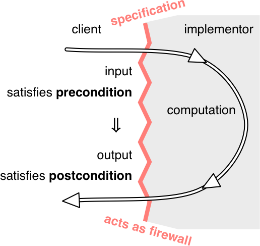
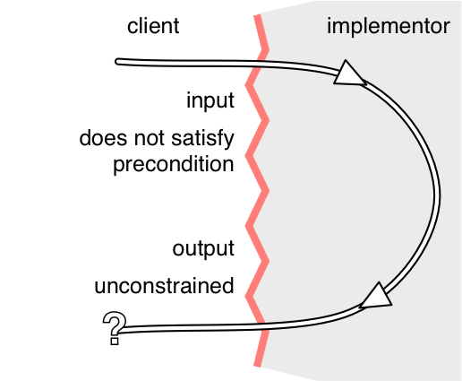
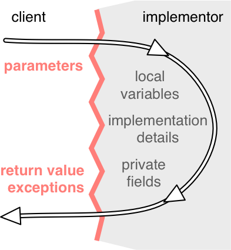

# Why specifications?

Many of the nastiest bugs in programs arise because of misunderstandings about behavior at the interface between two pieces of code. Although every programmer has specifications in mind, not all programmers write them down. As a result, different programmers on a team have different specifications in mind. When the program fails, it’s hard to determine where the error is.

Specifications are good for the client of a method because they spare the task of reading code.

Specifications are good for the implementer of a method because they give the implementor freedom to change the implementation without telling clients. Specifications can make code faster, too. We’ll see that using a weaker specification can rule out certain states in which a method might be called. This restriction on the inputs might allow the implementor to skip an expensive check that is no longer necessary and use a more efficient implementation.

The contract acts as a firewall between client and implementor. It shields the client from the details of the workings of the unit — you don’t need to read the source code of the procedure if you have its specification. And it shields the implementor from the details of the usage of the unit; he doesn’t have to ask every client how she plans to use the unit. This firewall results in decoupling, allowing the code of the unit and the code of a client to be changed independently, so long as the changes respect the specification — each obeying its obligation.

# Specification structure

A specification of a method consists of several clauses:

- a precondition, indicated by the keyword requires
- a postcondition, indicated by the keyword effects
- The precondition is an obligation on the client (i.e., the caller of the method). It’s a condition over the state in which the method is invoked.





The postcondition is an obligation on the implementer of the method. If the precondition holds for the invoking state, the method is obliged to obey the postcondition, by returning appropriate values, throwing specified exceptions, modifying or not modifying objects, and so on.

The overall structure is a logical implication: if the precondition holds when the method is called, then the postcondition must hold when the method completes.

If the precondition does not hold when the method is called, the implementation is not bound by the postcondition. It is free to do anything, including not terminating, throwing an exception, returning arbitrary results, making arbitrary modifications, etc.

## Specifications in Java

Java has a convention for documentation comments , in which parameters are described by @param clauses and results are described by @return and @throws clauses. You should put the preconditions into @param where possible, and postconditions into @return and @throws .

More at:

- https://javaworkshop.sourceforge.net/chapter4.html
- https://www.oracle.com/technetwork/java/javase/documentation/index-137868.html

# Null references

In Java, references to objects and arrays can also take on the special value null, which means that the reference doesn’t point to an object.

- Primitives cannot be null, and the compiler will reject such attempts with static errors.
- We can assign null to any non-primitive variable, but you’ll get errors at runtime because you can’t call any methods or use any fields with one of these references.
- Arrays of non-primitives and collections like List might be non-null but contain null as a value.

### Avoid null

Null values are troublesome and unsafe, so much so that you’re well advised to remove them from your design vocabulary. In 6.005 — and in fact in most good Java programming — null values are implicitly disallowed in parameters and return values . So every method implicitly has a precondition on its object and array parameters that they be non-null. Every method that returns an object or an array implicitly has a postcondition that its return value is non-null. If a method allows null values for a parameter, it should explicitly state it, or if it might return a null value as a result, it should explicitly state it.

There are extensions to Java that allow you to forbid null directly in the type declaration, e.g.:

```
static boolean addAll(@NonNull List<T> list1, @NonNull List<T> list2)
```

# What a specification may talk about

A specification of a method can talk about the parameters and return value of the method, but it should never talk about local variables of the method or private fields of the method’s class. You should consider the implementation invisible to the reader of the spec.



# Testing and specifications

black box tests that are chosen with only the specification in mind, and glass box tests that are chosen with knowledge of the actual implementation. But it’s important to note that even glass box tests must follow the specification. Your implementation may provide stronger guarantees than the specification calls for, or it may have specific behavior where the specification is undefined. But your test cases should not count on that behavior. Test cases must obey the contract, just like every other client.

So what does glass box testing mean, if it can’t go beyond the spec? It means you are trying to find new test cases that exercise different parts of the implementation, but still checking those test cases in an implementation-independent way. For example, testing for repeat values in the case of a stack. Or any other internal optimizations in the code.

## Testing units

Our tests will nearly always rely on the specs of Java library methods, but a unit test for one method we’ve written shouldn’t fail if a different method fails to satisfy its spec. As we saw in the example, a test for extractWords shouldn’t fail if getWebPage doesn’t satisfy its postcondition. ***In other words, the test that should be in charge of catching getWebPage 's error is the one testing getWebPage, not a foreign test such as that one of extractWords.***

# Specifications for mutating methods

#### mutation is disallowed unless stated otherwise.