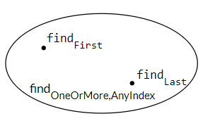
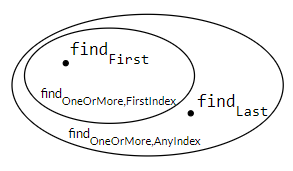

# Comparing Specifications

In this reading we’ll look at different specs for similar behaviors, and talk about the tradeoffs between them. We’ll look at three dimensions for comparing specs:

- How **deterministic** it is. Does the spec define only a single possible output for a given input, or allow the implementor to choose from a set of legal outputs?
    
- How **declarative** it is. Does the spec just characterize what the output should be, or does it explicitly say how to compute the output?
    
- How **strong** it is. Does the spec have a small set of legal implementations, or a large set?
    

# Deterministic vs. underdetermined specs

A specification is **Deterministic** if its value is completely determined when the precondition is satisfied. There are no valid inputs for which there is more than one valid output.

Note that this is different from nondeterministic in the usual sense of that word. Nondeterministic code sometimes behaves one way and sometimes another, even if it is given the same input. This can happen, for example, when the code’s behavior depends on a random number. **But a specification which is not deterministic doesn’t have to have a nondeterministic implementation. It can be satisfied by a fully deterministic implementation.**

To avoid the confusion, we’ll refer to specifications that are not deterministic as *underdetermined*.

# Declarative vs. operational specs

There are two kinds of specifications. **Operational** specifications give a series of steps that the method performs; pseudocode descriptions are operational. **Declarative** specifications don’t give details of intermediate steps. Instead, they just give properties of the final outcome, and how it’s related to the initial state.

Almost always, declarative specifications are preferable. They’re usually shorter, easier to understand, and most importantly, they don’t inadvertently expose implementation details that a client may rely on (and then find no longer hold when the implementation is changed).

### Do not use an operational specification as a comment to explain something to a maintainer. If required, use comments within the body of the method, not the spec comment.

### For a given specification, there may be many ways to express it declaratively. It's our job to choose the clearest specification for clients and maintainers.

# Stronger vs. weaker specs

Suppose you want to change a method, either how it behaves or the specification itself. And there are already clients that depend on the method's current specification. How do you compare the behavior of two specifications to decide whether it's safe to replace the old spec?

#### A specification S2 is stronger than or equal to a specification S1 if:

- S2's precondition is weaker than or equal to S1's,
    and
- S2's postcondition is stronger than or equal to S1's. for the states that satisfy S1's condition.

### If this is the case, then an implementation that satisfies S2 can be used to satisfy S1 as well, and it’s safe to replace S1 with S2 in your program.

These two rules embody several ideas. First, you can always weaken the precondition, placing fewer demands on a client will never upset them. Second, you can always strengthen the post-condition, which means making more promises.

# Diagramming specifications



We draw points representing individual *Implementations*. We draw each specification as a region, which will contain those implementations satisfying the precondition-implies-postcondition contract, and will leave out those which do not.

We can imagine clients looking in on this space: the specification acts as a firewall.

- Implementors have the freedom to move around inside the spec, changing their code without fear of upsetting a client. This is crucial in order for the implementor to be able to improve the performance of their algorithm, the clarity of their code, or to change their approach when they discover a bug, etc.
    
- Clients don’t know which implementation they will get. They must respect the spec, but also have the freedom to change how they’re using the implementation without fear that it will suddenly break.
    



How will similar specifications relate to one another? Suppose we start with specification S1 and use it to create a new specification S2.

- First, let's strengthen the postcondition. Now S2's postcondition is stronger than S1's.
- - For implementors this means that they have less freedom, the requirements on their output are stronger.

- Second, let's weaken the precondition. Which makes S2's a stronger specification. 
- - Implementations will have to handle new inputs that were previously excluded by the spec.


**Could there be implementations inside findOneOrMore,FirstIndex but outside findOneOrMore,AnyIndex?**
No. All of those implementations satisfy a stronger postcondition than what findOneOrMore, AnyIndex demands.


#### We see that when S2 is stronger that S1, it defines a smaller region in this diagram; a weaker specification defines a larger region.

# Designing good specifications

#### The specification should be coherent
The spec shouldn’t have lots of different cases. Long argument lists, deeply nested if-statements, and boolean flags are all signs of trouble.

#### The results of a call should be informative
Never leave place for ambiguity. For example, imagine your specification accepts a map containing null values. And your implementation will try to return the value in the map for a given key. But also, will return null given another set of conditionals. In this case, the client will have no way of telling whether a given null value was return because it was part of the map or because something went wrong.
#### The specification should be strong enough
Of course the spec should give clients a strong enough guarantee in the general case — it needs to satisfy their basic requirements. 
#### The specification should also be weak enough
Consider:
```
static File open(String filename)
  effects: opens a file named filename
```
This is a bad specification. It lacks important details: is the file opened for reading or writing? Does it already exist or is it created? And it’s too strong, since there’s no way it can guarantee to open a file. Instead, the specification should say something much weaker: that it attempts to open a file, and if it succeeds, the file has certain properties.

#### The specification should use abstract types where possible
Writing our specification with abstract types gives more freedom to both the client and the implementor. In Java, this often means using an interface type, like Map or Reader , instead of specific implementation types like HashMap or FileReader.

- This is important when your implementation doesn't rely on the particular features of specific implementations such as HashMap. So we can make it broader by using the abstract type.

# Precondition or postcondition?
Another design issue is whether to use a precondition, and if so, whether the method code should attempt to make sure the precondition has been met before proceeding. In fact, the most common use of preconditions is to demand a property precisely because it would be hard or expensive for the method to check it.

As mentioned above, a non-trivial precondition inconveniences clients, because they have to ensure that they don’t call the method in a bad state (that violates the precondition); if they do, there is no predictable way to recover from the error. So users of methods don’t like preconditions. That’s why the Java API classes, for example, tend to specify (as a postcondition) that they throw unchecked exceptions when arguments are inappropriate. This approach makes it easier to find the bug or incorrect assumption in the caller code that led to passing bad arguments. In general, it’s better to fail fast , as close as possible to the site of the bug, rather than let bad values propagate through a program far from their original cause.

The decision of whether to use a precondition is an engineering judgment. The key factors are the cost of the check (in writing and executing code), and the scope of the method. If it’s only called locally in a class, the precondition can be discharged by carefully checking all the sites that call the method. But if the method is public, and used by other developers, it would be less wise to use a precondition. Instead, like the Java API classes, you should throw an exception.

# About access control
Public methods are freely accessible to other parts of the program. Making a method public advertises it as a service that your class is willing to provide. If you make all your methods public — including helper methods that are really meant only for local use within the class — then other parts of the program may come to depend on them, which will make it harder for you to change the internal implementation of the class in the future. Your code won’t be as ready for change .

Making internal helper methods public will also add clutter to the visible interface your class offers. Keeping internal things private makes your class’s public interface smaller and more coherent (meaning that it does one thing and does it well). Your code will be easier to understand.


# About static vs. instance methods

We have also been using static for almost all of our methods, again without much discussion. Static methods are not associated with any particular instance of a class, while instance methods (declared without the static keyword) must be called on a particular object.

Specifications for instance methods are written just the same way as specifications for static methods, but they will often refer to properties of the instance on which they were called.