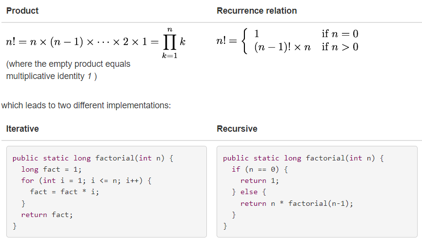

# Recursion

A recursive function is defined in terms of base cases and recursive steps.

- In a base case, we compute the result immediately given the inputs to the function call.
- In a recursive step, we compute the result with the help of one or more recursive calls to this same function, but with the inputs somehow reduced in size or complexity, closer to a base case.

Consider writing a function to compute factorial. We can define factorial in two different ways:


And here we can see and implementation for the Fibonacci series:

```
/**
 * @param n >= 0
 * @return the nth Fibonacci number 
 */
public static int fibonacci(int n) {
    if (n == 0 || n == 1) {
        return 1; // base cases
    } else {
        return fibonacci(n-1) + fibonacci(n-2); // recursive step
    }
}
```

# Structure of Recursive Implementations

A recursive implementation always has two parts:

- **base case**, which is the simplest, smallest instance of the problem, that can’t be decomposed any further. Base cases often correspond to emptiness – the empty string, the empty list, the empty tree, zero, etc.
- **recursive step**, which decomposes a larger instance of the problem into one or more simpler or smaller instances that can be solved by recursive calls, and then recombines the results of those subproblems to produce the solution to the original problem.

**It’s important for the recursive step to transform the problem instance into something smaller**, otherwise the recursion may never end. If every recursive step shrinks the problem, and the base case lies at the bottom, then the recursion is guaranteed to be finite.

# Choosing the Right Decomposition for a Problem

Finding the right way to decompose a problem, such as a method implementation, is important. Good decompositions are simple, short, easy to understand, safe from bugs, and ready for change.
Recursion is an elegant and simple decomposition for some problems. Suppose we want to implement this specification:

```
/**
 * @param word consisting only of letters A-Z or a-z
 * @return all subsequences of word, separated by commas,
 * where a subsequence is a string of letters found in word 
 * in the same order that they appear in word.
 */
public static String subsequences(String word)
```

For example, subsequences("abc") might return "abc,ab,bc,ac,a,b,c,". Note the trailing comma preceding the empty subsequence, which is also a valid subsequence.

```
public static String subsequences(String word) {
     if (word.isEmpty()) {
         return ""; // base case
     } else {
         char firstLetter = word.charAt(0);
         String restOfWord = word.substring(1);
         
         String subsequencesOfRest = subsequences(restOfWord);
         
         String result = "";
         for (String subsequence : subsequencesOfRest.split(",", -1)) {
             result += "," + subsequence;
             result += "," + firstLetter + subsequence;
         }
         result = result.substring(1); // remove extra leading comma
         return result;
     }
 }
```

# Helper Methods

In the last solution we used a direct recursive implementation, where we are using the existing specification of the recursive method to solve the subproblems.

In some cases, it’s useful to require a stronger (or different) specification for the recursive steps, to make the recursive decomposition simpler or more elegant. In this case, what if we built up a partial subsequence using the initial letters of the word, and used the recursive calls to complete that partial subsequence using the remaining letters of the word?

```
/**
 * Return all subsequences of word (as defined above) separated by commas,
 * with partialSubsequence prepended to each one.
 */
private static String subsequencesAfter(String partialSubsequence, String word) {
    if (word.isEmpty()) {
        // base case
        return partialSubsequence;
    } else {
        // recursive step
        return subsequencesAfter(partialSubsequence, word.substring(1))
             + ","
             + subsequencesAfter(partialSubsequence + word.charAt(0), word.substring(1));
    }
}
```

This subsequencesAfter method is called a helper method. It satisfies a different spec from the original subsequences, because it has a new parameter partialSubsequence . This parameter fills a similar role that a local variable would in an iterative implementation. It holds temporary state during the evolution of the computation.

To finish the implementation, we need to implement the original subsequences spec, which gets the ball rolling by calling the helper method with an initial value for the partial subsequence parameter:

```
public static String subsequences(String word) {
    return subsequencesAfter("", word);
}
```

#### Don’t expose the helper method to your clients.

The last changes we made were entirely implementation-specific. If you change your approach, as shown in the example above, don't change the original spec of your method, and don't force your clients to comply to a new spec. Use a private helper function for the recursion, and have your public method call it with the correct initializations, as shown above.

# Recursive Problems vs. Recursive Data

- One cue to use recursion is, as we saw, the ability we have to decompose problems into smaller problems and base cases.
- Another cue is when the data you are operating on is inherently recursive in structure. For example, a filesystem. Which contains folders, which might themselves contain folders or files, and so on.

# Reentrant Code

Recursion – a method calling itself – is a special case of a general phenomenon in programming called reentrancy. Reentrant code can be safely re-entered, meaning that it can be called again even while a call to it is underway. Reentrant code keeps its state entirely in parameters and local variables, and doesn’t use static variables or global variables, and doesn’t share aliases to mutable objects with other parts of the program, or other calls to itself. Recursion can happen in multiple ways, for instance, when two methods mutually call each other. (A calls be B, which in turn calls A, and so on).

Reentrant code is important for concurrency, since in a concurrent program, a method may be called at the same time by different parts of the program that are running concurrently.

#### It’s good to design your code to be reentrant as much as possible. Reentrant code is safer from bugs and can be used in more situations, like concurrency, callbacks, or mutual recursion.

# When to Use Recursion Rather Than Iteration

- The problem is naturally recursive (e.g. Fibonacci)
- The data is naturally recursive (e.g. filesystem)

Another reason to use recursion is to take more advantage of immutability. In an ideal recursive implementation, all variables are final, all data is immutable, and the recursive methods are all pure functions in the sense that they do not mutate anything. The behavior of a method can be understood simply as a relationship between its parameters and its return value, with no side effects on any other part of the program. **(Aka functional programming).**

**One downside of recursion is that it may take more space than an iterative solution.** Building up a stack of recursive calls consumes memory temporarily, and the stack is limited in size, which may become a limit on the size of the problem that your recursive implementation can solve.

# Common Mistakes in Recursive Implementations

- The base case is missing entirely, or the problem needs more than one base case but not all the base cases are covered.
- The recursive step doesn’t reduce to a smaller subproblem, so the recursion doesn’t converge.