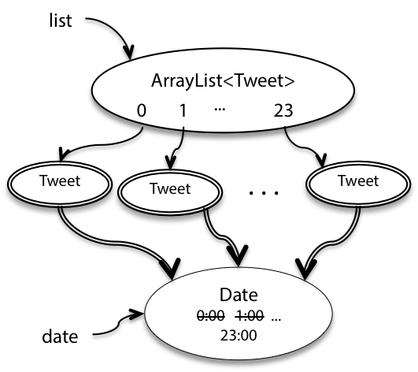
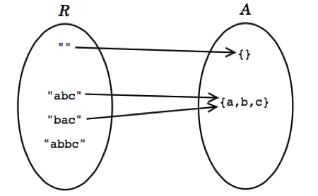
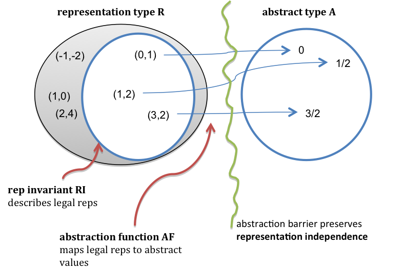

# Invariants

The final, and perhaps most important, property of an abstract data type is that it preserves its own invariants. An invariant is a property of a program that is always true, for every possible runtime state of the program.

Saying that the ADT preserves its own invariants means that the ADT is responsible for ensuring that its own invariants hold. It doesn’t depend on good behavior from its clients.

When an ADT preserves its own invariants, reasoning about the code becomes much easier. If you can count on the fact that Strings never change, you can rule out that possibility when you’re debugging code that uses Strings. Contrast that with a string type that guarantees that it will be immutable only if its clients promise not to change it. Then you’d have to check all the places in the code where the string might be used.

# Immutability

```
/**
 * This immutable data type represents a tweet from Twitter.
 */
public class Tweet {

    public String author;
    public String text;
    public Date timestamp;

    /**
     * Make a Tweet.
     * @param author    Twitter user who wrote the tweet
     * @param text      text of the tweet
     * @param timestamp date/time when the tweet was sent
     */
    public Tweet(String author, String text, Date timestamp) {
        this.author = author;
        this.text = text;
        this.timestamp = timestamp;
    }
}
```

How do we guarantee that these Tweet objects are immutable – that, once a tweet is created, its author, message, and date can never be changed?

The first threat to immutability comes from the fact that clients can directly access its fields:

```
Tweet t = new Tweet("justinbieber", 
                    "Thanks to all those beliebers out there inspiring me every day", 
                    new Date());
t.author = "rbmllr";
```

This is an example of representation exposure, meaning that code outside the class can modify the representation directly. Rep exposure like this threatens not only invariants, but also representation independence. We can’t change the implementation of Tweet without affecting all the clients who are directly accessing those fields.

Fortunately, Java gives us language mechanisms to deal with this kind of rep exposure:

```
public class Tweet {

    private final String author;
    private final String text;
    private final Date timestamp;

    public Tweet(String author, String text, Date timestamp) {
        this.author = author;
        this.text = text;
        this.timestamp = timestamp;
    }

    /** @return Twitter user who wrote the tweet */
    public String getAuthor() {
        return author;
    }

    /** @return text of the tweet */
    public String getText() {
        return text;
    }

    /** @return date/time when the tweet was sent */
    public Date getTimestamp() {
        return timestamp;
    }

}
```

The private and public keywords indicate which fields and methods are accessible only within the class and which can be accessed from outside the class. The final keyword guarantees that the fields of this immutable type won’t be reassigned after the object is constructed.

But the representation is still exposed! Consider the following:

```
/** @return a tweet that retweets t, one hour later*/
public static Tweet retweetLater(Tweet t) {
    Date d = t.getTimestamp();
    d.setHours(d.getHours()+1);
    return new Tweet("rbmllr", t.getText(), d);
}
```

What’s the problem here? The getTimestamp call returns a reference to the same Date object referenced by tweet t . t.timestamp and d are aliases to the same mutable object. So when that date object is mutated by d.setHours() , this affects the date in t as well.

Tweet ’s immutability invariant has been broken. The problem is that Tweet leaked out a reference to a mutable object that its immutability depended on. We exposed the rep, in such a way that Tweet can no longer guarantee that its objects are immutable.

## Defense Copying

We can patch this kind of rep exposure by using defensive copying: making a copy of a mutable object to avoid leaking out references to the rep. Here’s the code:

```
public Date getTimestamp() {
    return new Date(timestamp.getTime());
}
```

This still doesn't resolve all issues. Consider:

```
/** @return a list of 24 inspiring tweets, one per hour today */
public static List<Tweet> tweetEveryHourToday () {
    List<Tweet> list = new ArrayList<Tweet>(); 
    Date date = new Date();
    for (int i = 0; i < 24; i++) {
        date.setHours(i);
        list.add(new Tweet("rbmllr", "keep it up! you can do it", date));
    } 
    return list;
}
```

Notice that the constructor of Tweet saves the reference that was passed in, so all 24 Tweet objects end up with the same time, as shown in this snapshot diagram.



Again, the immutability of Tweet has been violated. We can fix this problem by using defensive copying, this time in the constructor:

```
public Tweet(String author, String text, Date timestamp) {
    this.author = author;
    this.text = text;
    this.timestamp = new Date(timestamp.getTime());
}
```

But why don't just add a precondition in the specification? This approach is sometimes taken when there isn’t any other reasonable alternative – for example, when the mutable object is too large to copy efficiently. But the cost in your ability to reason about the program, and your ability to avoid bugs, is enormous. In the absence of compelling arguments to the contrary, it’s almost always worth it for an abstract data type to guarantee its own invariants.

# Rep Invariant and Abstraction Function

Now take a look at the theory underlying abstract data types. It has immediate practical application to the design and implementation of abstract types.

In thinking about an abstract type, it helps to consider the relationship between two spaces of values.

The space of representation values (or rep values) consists of the values of the actual implementation entities.

The space of abstract values consists of the values that the type is designed to support. These are a figment of our imaginations. They’re platonic entities that don’t exist as described, but they are the way we want to view the elements of the abstract type, as clients of the type.

Suppose, for example, that we choose to use a string to represent a set of characters:

```
public class CharSet {
    private String s;
    ...
}
```

- **Every abstract value is mapped to by some rep value.** The purpose of implementing the abstract type is to support operations on abstract values. Presumably, then, we will need to be able to create and manipulate all possible abstract values, and they must therefore be representable.
    
- **Some abstract values are mapped to by more than one rep value.** This happens because the representation isn’t a tight encoding. There’s more than one way to represent an unordered set of characters as a string.
    
- **Not all rep values are mapped.** In this case, the string “abbc” is not mapped. In this case, we have decided that the string should not contain duplicates. This will allow us to terminate the remove method when we hit the first instance of a particular character, since we know there can be at most one.
    



In practice, we can only illustrate a few elements of the two spaces and their relationships; the graph as a whole is infinite. So we describe it by giving two things:

1.  An abstraction function that maps rep values to the abstract values they represent:

AF : R → A

The arrows in the diagram show the abstraction function. In the terminology of functions, the properties we discussed above can be expressed by saying that the function is surjective (also called onto), not necessarily injective (one-to-one) and therefore not necessarily bijective, and often partial.

2.  A rep invariant that maps rep values to booleans:

RI : R → boolean

For a rep value r , RI(r) is true if and only if r is mapped by AF. In other words, RI tells us whether a given rep value is well-formed. Alternatively, you can think of RI as a set: it’s the subset of rep values on which AF is defined.

# Example: Rational Numbers

```
public class RatNum {

    private final int numer;
    private final int denom;

    // Rep invariant:
    //   denom > 0
    //   numer/denom is in reduced form

    // Abstraction Function:
    //   represents the rational number numer / denom

    /** Make a new Ratnum == n.
     *  @param n value */
    public RatNum(int n) {
        numer = n;
        denom = 1;
        checkRep();
    }

    /** Make a new RatNum == (n / d).
     *  @param n numerator
     *  @param d denominator
     *  @throws ArithmeticException if d == 0 */
    public RatNum(int n, int d) throws ArithmeticException {
        // reduce ratio to lowest terms
        int g = gcd(n, d);
        n = n / g;
        d = d / g;

        // make denominator positive
        if (d < 0) {
            numer = -n;
            denom = -d;
        } else {
            numer = n;
            denom = d;
        }
        checkRep();
    }
}
```

Here is a picture of the abstraction function and rep invariant for this code. The RI requires that numerator/denominator pairs be in reduced form (i.e., lowest terms), so pairs like (2,4) above should be drawn as outside the RI.



## Checking the Rep Invariant

The rep invariant isn’t just a neat mathematical idea. If your implementation asserts the rep invariant at run time, then you can catch bugs early. Here’s a method for RatNum that tests its rep invariant:

```
// Check that the rep invariant is true
// *** Warning: this does nothing unless you turn on assertion checking
// by passing -enableassertions to Java
private void checkRep() {
    assert denom > 0;
    assert gcd(numer, denom) == 1;
}
```

You should certainly call checkRep() to assert the rep invariant at the end of every operation that creates or mutates the rep – in other words, creators, producers, and mutators.

checkRep is private because the implementation itself is the one tasked with checking and enforcing its rep invariants.

# Documenting the AF, RI, and Safety from Rep Exposure

It’s good practice to document the abstraction function and rep invariant in the class, using comments right where the private fields of the rep are declared. As we did above.

Another piece of documentation that 6.005 asks you to write is a rep exposure safety argument . This is a comment that examines each part of the rep, looks at the code that handles that part of the rep (particularly with respect to parameters and return values from clients, because that is where rep exposure occurs), and presents a reason why the code doesn’t expose the rep.

Here’s an example of Tweet with its rep invariant, abstraction function, and safety from rep exposure fully documented:

```
// Immutable type representing a tweet.
public class Tweet {

    private final String author;
    private final String text;
    private final Date timestamp;

    // Rep invariant:
    //   author is a Twitter username (a nonempty string of letters, digits, underscores)
    //   text.length <= 140
    // Abstraction Function:
    //   represents a tweet posted by author, with content text, at time timestamp 
    // Safety from rep exposure:
    //   All fields are private;
    //   author and text are Strings, so are guaranteed immutable;
    //   timestamp is a mutable Date, so Tweet() constructor and getTimestamp() 
    //        make defensive copies to avoid sharing the rep's Date object with clients.

    // Operations (specs and method bodies omitted to save space)
    public Tweet(String author, String text, Date timestamp) { ... }
    public String getAuthor() { ... }
    public String getText() { ... }
    public Date getTimestamp() { ... }
}
```

Notice that we don’t have any explicit rep invariant conditions on timestamp (aside from the conventional assumption that timestamp!=null , which we have for all object references). But we still need to include timestamp in the rep exposure safety argument, because the immutability property of the whole type depends on all the fields remaining unchanged.

Here are the arguments for RatNum:

```
// Immutable type representing a rational number.
public class RatNum {
    private final int numer;
    private final int denom;

    // Rep invariant:
    //   denom > 0
    //   numer/denom is in reduced form, i.e. gcd(|numer|,denom) = 1
    // Abstraction Function:
    //   represents the rational number numer / denom
    // Safety from rep exposure:
    //   All fields are private, and all types in the rep are immutable.

    // Operations (specs and method bodies omitted to save space)
    public RatNum(int n) { ... }
    public RatNum(int n, int d) throws ArithmeticException { ... }
    ...
}
```

## How to Establish Invariants

An invariant is a property that is true for the entire program – which in the case of an invariant about an object, reduces to the entire lifetime of the object.

To make an invariant hold, we need to:

- make the invariant true in the initial state of the object; and
- ensure that all changes to the object keep the invariant true.

Translating this in terms of the types of ADT operations, this means:

- creators and producers must establish the invariant for new object instances; and
- mutators and observers must preserve the invariant.

The risk of rep exposure makes the situation more complicated. If the rep is exposed, then the object might be changed anywhere in the program, not just in the ADT’s operations, and we can’t guarantee that the invariant still holds after those arbitrary changes. So the full rule for proving invariants is:

**Structural induction.** If an invariant of an abstract data type is

1.  established by creators and producers;
2.  preserved by mutators, and observers; and
3.  no representation exposure occurs,
    then the invariant is true of all instances of the abstract data type.

# ADT invariants replace preconditions

An enormous advantage of a well-designed abstract data type is that it encapsulates and enforces properties that we would otherwise have to stipulate in a precondition. For example, instead of a spec like this, with an elaborate precondition:

```
/** 
 * @param set1 is a sorted set of characters with no repeats
 * @param set2 is likewise
 * @return characters that appear in one set but not the other,
 *  in sorted order with no repeats 
 */
static String exclusiveOr(String set1, String set2);
```

We can instead use an ADT that captures the desired property:

```
/** @return characters that appear in one set but not the other */
static SortedSet<Character> exclusiveOr(SortedSet<Character>  set1, SortedSet<Character> set2);
```

This is easier to understand, because the name of the ADT conveys all the programmer needs to know. It’s also safer from bugs, because Java static checking comes into play, and the required condition (sorted with no repeats) can be enforced in exactly one place, the SortedSet type.

# Summary

- An invariant is a property that is always true of an ADT object instance, for the lifetime of the object.
- A good ADT preserves its own invariants. Invariants must be established by creators and producers, and preserved by observers and mutators.
- The rep invariant specifies legal values of the representation, and should be checked at runtime with `checkRep()` .
- The abstraction function maps a concrete representation to the abstract value it represents.
- Representation exposure threatens both representation independence and invariant preservation.

The topics of today’s reading connect to our three properties of good software as follows:

- **Safe from bugs.** A good ADT preserves its own invariants, so that those invariants are less vulnerable to bugs in the ADT’s clients, and violations of the invariants can be more easily isolated within the implementation of the ADT itself. Stating the rep invariant explicitly, and checking it at runtime with checkRep(), catches misunderstandings and bugs earlier, rather than continuing on with a corrupt data structure.
    
- **Easy to understand.** Rep invariants and abstraction functions explicate the meaning of a data type’s representation, and how it relates to its abstraction.
    
- **Ready for change.** Abstract data types separate the abstraction from the concrete representation, which makes it possible to change the representation without having to change client code.