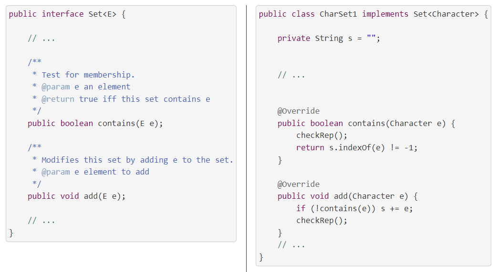
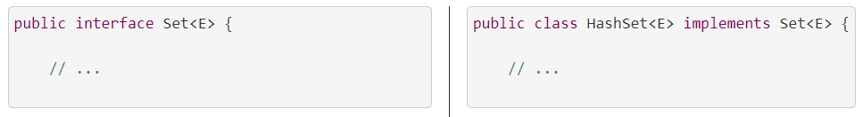
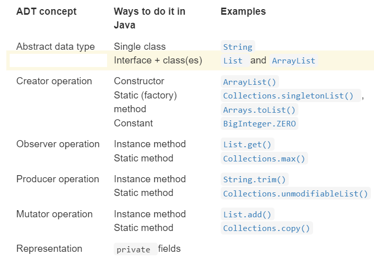

# Interfaces

An interface in Java is a list of method signatures, but no method bodies. A class implements an interface if it declares the interface in its implements clause, and provides method bodies for all of the interface’s methods. So one way to define an abstract data type in Java is as an interface, with its implementation as a class implementing that interface.

**One advantage of this approach is that the interface specifies the contract for the client and nothing more. The interface is all a client programmer needs to read to understand the ADT.**

\*\*Another advantage is that multiple different representations of the abstract data type can co-exist in the same program, as different classes implementing the interface. \*\*

# Subtypes

Recall that a type is a set of values. The Java List type is defined by an interface. If we think about all possible List values, none of them are List objects: we cannot create instances of an interface. Instead, those values are all ArrayList objects, or LinkedList objects, or objects of another class that implements List . A subtype is simply a subset of the supertype : ArrayList and LinkedList are subtypes of List .

“B is a subtype of A” means “every B is an A.” In terms of specifications: “every B satisfies the specification for A.”

**That means B is only a subtype of A if B’s specification is at least as strong as A’s specification.**

# Example: MyString

Let’s revisit MyString . Using an interface instead of a class for the ADT, we can support multiple implementations:

```
/** MyString represents an immutable sequence of characters. */
public interface MyString { 

    // We'll skip this creator operation for now
    // /** @param b a boolean value
    //  *  @return string representation of b, either "true" or "false" */
    // public static MyString valueOf(boolean b) { ... }

    /** @return number of characters in this string */
    public int length();

    /** @param i character position (requires 0 <= i < string length)
     *  @return character at position i */
    public char charAt(int i);

    /** Get the substring between start (inclusive) and end (exclusive).
     *  @param start starting index
     *  @param end ending index.  Requires 0 <= start <= end <= string length.
     *  @return string consisting of charAt(start)...charAt(end-1) */
    public MyString substring(int start, int end);
}
```

We’ll skip the static valueOf method and come back to it in a minute. Instead, let’s go ahead using a different technique from our toolbox of ADT concepts in Java : constructors.

Here’s our first implementation:

```
public class SimpleMyString implements MyString {

    private char[] a;

    /* Create an uninitialized SimpleMyString. */
    private SimpleMyString() {}

    /** Create a string representation of b, either "true" or "false".
     *  @param b a boolean value */
    public SimpleMyString(boolean b) {
        a = b ? new char[] { 't', 'r', 'u', 'e' } 
              : new char[] { 'f', 'a', 'l', 's', 'e' };
    }

    @Override public int length() { return a.length; }

    @Override public char charAt(int i) { return a[i]; }

    @Override public MyString substring(int start, int end) {
        SimpleMyString that = new SimpleMyString();
        that.a = new char[end - start];
        System.arraycopy(this.a, start, that.a, 0, end - start);
        return that;
    }
}
```

And here’s the optimized implementation:

```
public class FastMyString implements MyString {

    private char[] a;
    private int start;
    private int end;

    /* Create an uninitialized FastMyString. */
    private FastMyString() {}

    /** Create a string representation of b, either "true" or "false".
     *  @param b a boolean value */
    public FastMyString(boolean b) {
        a = b ? new char[] { 't', 'r', 'u', 'e' } 
              : new char[] { 'f', 'a', 'l', 's', 'e' };
        start = 0;
        end = a.length;
    }

    @Override public int length() { return end - start; }

    @Override public char charAt(int i) { return a[start + i]; }

    @Override public MyString substring(int start, int end) {
        FastMyString that = new FastMyString();
        that.a = this.a;
        that.start = this.start + start;
        that.end = this.start + end;
        return that;
    }
}
```

- Compare these classes to the implementations of MyString in Abstract Data Types . Notice how the code that previously appeared in static valueOf methods now appears in the constructors.
    
- Notice the use of @Override . This annotation informs the compiler that the method must have the same signature as one of the methods in the interface we’re implementing. The compiler already checks for that implementation so, this rather informs readers to look at the spec of the method in the interface.
    
- And notice the private empty constructors we use to make new instances in substring(..) before we fill in their reps with data. They were not necessary before but are now because we added the constructor that takes boolean b.
    
	

How will clients use this ADT? Here’s an example:

```
MyString s = new FastMyString(true);
System.out.println("The first character is: " + s.charAt(0));
```

This pattern breaks the abstraction barrier between the abstract type and its concrete representations. Clients must know the name of the concrete representation class. Because interfaces in Java cannot contain constructors, they must directly call one of the concrete class’ constructors. The spec of that constructor won’t appear in the interface, so there’s no static guarantee that different implementations will provide the same constructors.

Fortunately, interfaces are allowed to contain static methods, so we can implement the creator operation valueOf as a static factory method in the interface MyString :

```
public interface MyString { 

    /** @param b a boolean value
     *  @return string representation of b, either "true" or "false" */
    public static MyString valueOf(boolean b) {
        return new FastMyString(true);
    }

    // ...
```

Now a client can use the ADT without breaking the abstraction barrier:

```
MyString s = MyString.valueOf(true);
System.out.println("The first character is: " + s.charAt(0));
```

# Example: Set

Set is the ADT of finite sets of elements of some other type E . Here is a simplified version of the Set interface:

```
/** A mutable set.
 *  @param <E> type of elements in the set */
public interface Set<E> {
```

Set is an example of a generic type : a type whose specification is in terms of a placeholder type to be filled in later. Instead of separate specifications and implementations for Set&lt;string&gt;, Set&lt;integer&gt;, and so on, we design and implement one Set&lt;E&gt;.

We can match Java interfaces with our classification of ADT operations, starting with a creator:

```
    // example creator operation
    /** Make an empty set.
     *  @param <E> type of elements in the set
     *  @return a new set instance, initially empty */
    public static <E> Set<E> make() { ... } 
```

We now have mutators and observer methods. Notice how the specs are in terms of our abstract notion of a set. These specs should apply to any valid implementation of the set ADT.

```
    // example observer operations

    /** Get size of the set.
     *  @return the number of elements in this set */
    public int size();

    /** Test for membership.
     *  @param e an element
     *  @return true iff this set contains e */
    public boolean contains(E e);
    
    
        // example mutator operations

    /** Modifies this set by adding e to the set.
     *  @param e element to add */
    public void add(E e);

    /** Modifies this set by removing e, if found.
     *  If e is not found in the set, has no effect.
     *  @param e element to remove */
    public void remove(E e);
```

# Generic Interfaces

Suppose we want to implement the generic Set&lt;E&gt; interface above.

Generic interface, non-generic implementation. One way we might do this is to implement Set&lt;E&gt; for a particular type E.

When the interface mentions placeholder type E , the CharSet implementations replace E with Character . For example:


Generic interface, generic implementation. We can also implement the generic Set&lt;E&gt; interface without picking a type for E . In that case, we write our code blind to the actual type that clients will choose for E . Java’s HashSet does that for Set . It’s declaration looks like:



**A generic implementation can only rely on details of the placeholder types that are included in the interface’s specification. We’ll see in a future reading how HashSet relies on methods that every type in Java is required to implement — and only on those methods, because it can’t rely on methods declared in any specific type.**

# Why Interfaces?

- Documentation for both the compiler and for humans .
- Allowing performance trade-offs . Different implementations of the ADT can provide methods with very different performance characteristics. Different applications may work better with different choices, but we would like to code these applications in a way that is representation-independent.
- Optional methods . List from the Java standard library marks all mutator methods as optional.
- Methods with intentionally underdetermined specifications . An ADT for finite sets could leave unspecified the element order one gets when converting to a list.
- Multiple views of one class . A Java class may implement multiple methods.
- More and less trustworthy implementations .

# Realizing ADT Concepts in Java

