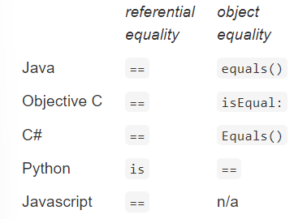
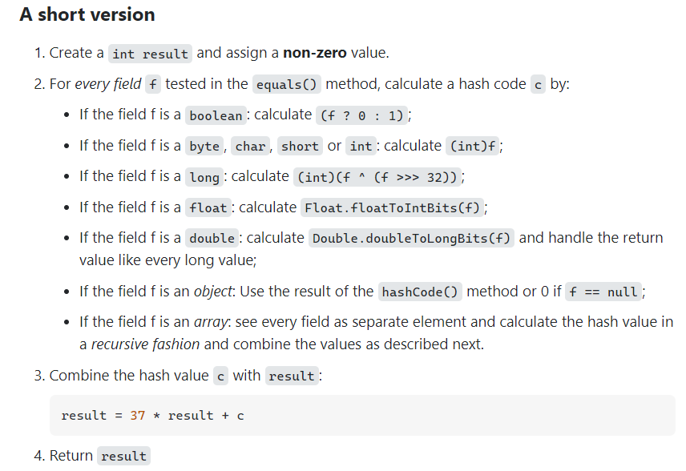

We’ve developed a rigorous notion of *data abstraction* by creating types that are characterized by their operations, not by their representation. For an abstract data type, the *abstraction function* explains how to interpret a concrete representation value as a value of the abstract type.

In this reading we turn to how we define the notion of *equality* of values in a data type: the abstraction function will give us a way to cleanly define the equality operation on an ADT.

In the physical world, every object is distinct, even if the distinction is just the position they occupy in space. Two physical objects are never truly “equal” to each other.

In the world of mathematical concepts, you can have multiple names for the same thing. 1+2, √9, and 3. So it is natural to ask what equality means.

# Three Ways to Regard Equality

- **Using an abstraction function.** An abstraction function f: R → A maps concrete instances of a data type to their corresponding abstract values. To use f as a definition for equality, we would say that a equals b if and only if f(a)=f(b).
    
- **Using a relation.** An equivalence is a relation E ⊆ T x T that is:
    
    - reflexive: E(t,t) ∀ t ∈ T
    
    - symmetric: E(t,u) ⇒ E(u,t)
    
    - transitive: E(t,u) ∧ E(u,v) ⇒ E(t,v)

To use E as a definition for equality, we would say that a equals b if and only if E(a,b).

- **Using observation.** We can say that two objects are equal when they cannot be distinguished by observation – every operation we can apply produces the same result for both objects. Consider the set expressions {1,2} and {2,1}. Using the observer operations available for sets, cardinality |…| and membership ∈, these expressions are indistinguishable.

In terms of abstract data types, “observation” means calling operations on the objects. So two objects are equal if and only if they cannot be distinguished by calling any operations of the abstract data type.

## Example: Duration

```
public class Duration {
    private final int mins;
    private final int secs;
    // rep invariant:
    //    mins >= 0, secs >= 0
    // abstraction function:
    //    represents a span of time of mins minutes and secs seconds

    /** Make a duration lasting for m minutes and s seconds. */
    public Duration(int m, int s) {
        mins = m; secs = s;
    }
    /** @return length of this duration in seconds */
    public long getLength() {
        return mins*60 + secs;
    }
}
```

Now which of the following values should be considered equal?

```
Duration d1 = new Duration (1, 2);
Duration d2 = new Duration (1, 3);
Duration d3 = new Duration (0, 62);
Duration d4 = new Duration (1, 2);
```

**In terms of the abstraction-function definition: all of them are equal, because they rely on the same abstraction function (how to calculate getLength).**

**In terms of the observational equality definition: Only d1 and d4, because their observers behave the same (getLength will report the same value, since they have the same fields).**

# == vs. equals()

Like many languages, Java has two different operations for testing equality, with different semantics.

- The `==` operator compares references. More precisely, it tests *referential* equality. Two references are == if they point to the same storage in memory.
- The `equals()` operation compares object contents – in other words, *object* equality, in the sense that we’ve been talking about in this reading.



# Equality of Immutable Types

The equals() method is defined by Object , and its default implementation looks like this:

```
public class Object {
    ...
    public boolean equals(Object that) {
        return this == that;
    }
}
```

In other words, the default meaning of equals() is the same as referential equality. For immutable data types, this is almost always wrong. So you have to override the equals() method, replacing it with your own implementation.

Here’s our first try for Duration :

```
public class Duration {
    ...   
    // Problematic definition of equals()
    public boolean equals(Duration that) {
        return this.getLength() == that.getLength();        
    }
}
```

There’s a subtle problem here. Why doesn’t this work? Let’s try this code:

```
Duration d1 = new Duration (1, 2);
Duration d2 = new Duration (1, 2);
Object o2 = d2;
d1.equals(d2) → true
d1.equals(o2) → false
```

What’s going on? It turns out that Duration has overloaded the equals() method, because the method signature was not identical to Object ’s. We actually have two equals() methods in Duration : an implicit equals(Object) inherited from Object , and the new equals(Duration) .

```
public class Duration extends Object {
    // explicit method that we declared:
    public boolean equals (Duration that) {
        return this.getLength() == that.getLength();
    }
    // implicit method inherited from Object:
    public boolean equals (Object that) {
        return this == that;
    }
}
```

So here’s the right way to implement Duration ’s equals() method:

```
@Override
public boolean equals (Object thatObject) {
    if (!(thatObject instanceof Duration)) return false;
    Duration thatDuration = (Duration) thatObject;
    return this.getLength() == thatDuration.getLength();
}
```

This fixes the problem:

```
Duration d1 = new Duration(1, 2);
Duration d2 = new Duration(1, 2);
Object o2 = d2;
d1.equals(d2) → true
d1.equals(o2) → true
```

## instanceof

The instanceof operator tests whether an object is an instance of a particular type. Using instanceof is dynamic type checking, not the static type checking we vastly prefer. In general, using instanceof in object-oriented programming is a bad smell. Another of our rules that holds true in most good Java programming — instanceof is disallowed anywhere except for implementing equals .

# The Object Contract

The contract can be found in the method specifications for the Object class. Now we focus on the contract for equals. When you override the equals method, you must adhere to its general contract. It states that:

- `equals` must define an equivalence relation – that is, a relation that is reflexive, symmetric, and transitive;
- `equals` must be consistent: repeated calls to the method must yield the same result provided no information used in `equals` comparisons on the object is modified;
- for a non-null reference `x` , `x.equals(null)` should return false;
- `hashCode` must produce the same result for two objects that are deemed equal by the `equals` method.

## Breaking the Equivalence Relation

Let’s start with the equivalence relation. We have to make sure that the definition of equality implemented by equals() is actually an equivalence relation as defined earlier: reflexive, symmetric, and transitive. If it isn’t, then operations that depend on equality (like sets, searching) will behave erratically and unpredictably.

## Breaking Hash Tables

A hash table is a representation for a mapping: an abstract data type that maps keys to values. Hash tables offer constant time lookup, so they tend to perform better than trees or lists. Keys don’t have to be ordered, or have any particular property, except for offering equals and hashCode .

Here’s how a hash table works. It contains an array that is initialized to a size corresponding to the number of elements that we expect to be inserted. When a key and a value are presented for insertion, we compute the hashcode of the key, and convert it into an index in the array’s range (e.g., by a modulo division). The value is then inserted at that index.

Hashcodes are designed so that the keys will be spread evenly over the indices. But occasionally a conflict occurs, and two keys are placed at the same index. So rather than holding a single value at an index, a hash table actually holds a list of key/value pairs, usually called a hash bucket. A key/value pair is implemented in Java simply as an object with two fields. On insertion, you add a pair to the list in the array slot determined by the hash code. For lookup, you hash the key, find the right slot, and then examine each of the pairs until one is found whose key equals the query key.

If two equal objects had distinct hashcodes, they might be placed in different slots. So if you attempt to lookup a value using a key equal to the one with which it was inserted, the lookup may fail.

Object ’s default hashCode() implementation is consistent with its default equals() :

```
public class Object {
  ...
  public boolean equals(Object that) { return this == that; }
  public int hashCode() { return /* the memory address of this */; }
}
```

For references a and b , if a == b , then the address of a == the address of b. So the Object contract is satisfied.

But immutable objects need a different implementation of hashCode() . For Duration , since we haven’t overridden the default hashCode() yet, we’re currently breaking the Object contract:

```
Duration d1 = new Duration(1, 2);
Duration d2 = new Duration(1, 2);
d1.equals(d2) → true
d1.hashCode() → 2392
d2.hashCode() → 4823
```

d1 and d2 are equal() , but they have different hash codes. So we need to fix that.

A simple and drastic way to ensure that the contract is met is for hashCode to always return some constant value, so every object’s hash code is the same. This satisfies the Object contract, but it would have a disastrous performance effect, since every key will be stored in the same slot, and every lookup will degenerate to a linear search along a long list.

The standard way to construct a more reasonable hash code that still satisfies the contract is to compute a hash code for each component of the object that is used in the determination of equality (usually by calling the hashCode method of each component), and then combining these, throwing in a few arithmetic operations. For Duration , this is easy, because the abstract value of the class is already an integer value:

```
@Override
public int hashCode() {
    return (int) getLength();
}
```

Here are some strategies to write decent hash code functions.



**https://stackoverflow.com/questions/113511/best-implementation-for-hashcode-method-for-a-collection**

Most crucially, if you don’t override hashCode at all, you’ll get the one from Object , which is based on the address of the object. If you have overridden equals , this will mean that you will have almost certainly violated the contract. So as a general rule:

### Always override hashCode when you override equals.

# Equality of Mutable Types

Recall our definition: two objects are equal when they cannot be distinguished by observation. With mutable objects, there are two ways to interpret this:

- when they cannot be distinguished by observation *that doesn’t change the state of the objects* , i.e., by calling only observer, producer, and creator methods. This is often strictly called **observational equality** , since it tests whether the two objects “look” the same, in the current state of the program.
- when they cannot be distinguished by *any* observation, even state changes. This interpretation allows calling any methods on the two objects, including mutators. This is often called **behavioral equality** , since it tests whether the two objects will “behave” the same, in this and all future states.

For immutable objects, observational and behavioral equality are identical, because there aren’t any mutator methods.

For mutable objects, it’s tempting to implement strict observational equality. Java uses observational equality for most of its mutable data types, in fact. If two distinct List objects contain the same sequence of elements, then equals() reports that they are equal.

*The lesson we should draw from this example is that **`equals()` should implement behavioral equality**. In general, that means that two references should be `equals()` if and only if they are aliases for the same object. So mutable objects should just inherit `equals()` and `hashCode()` from `Object` . For clients that need a notion of observational equality (whether two mutable objects “look” the same in the current state), it’s better to define a new method, e.g., `similar()` .*

# The Final Rule for equals() and hashCode()

**For immutable types** :

- `equals()` should compare abstract values. This is the same as saying `equals()` should provide behavioral equality.
- `hashCode()` should map the abstract value to an integer.

So immutable types must override both `equals()` and `hashCode()` .

**For mutable types** :

- `equals()` should compare references, just like `==` . Again, this is the same as saying `equals()` should provide behavioral equality.
- `hashCode()` should map the reference into an integer.

So mutable types should not override `equals()` and `hashCode()` at all, and should simply use the default implementations provided by `Object` . Java doesn’t follow this rule for its collections, unfortunately, leading to the pitfalls that we saw above.'

## Autoboxing and Equality

One more instructive pitfall in Java. We’ve talked about primitive types and their object type equivalents – for example, int and Integer . The object type implements equals() in the correct way, so that if you create two Integer objects with the same value, they’ll be equals() to each other:

```
Integer x = new Integer(3);
Integer y = new Integer(3);
x.equals(y) → true
```

But there’s a subtle problem here; == is overloaded. For reference types like Integer , it implements referential equality:

```
x == y // returns false
```

But for primitive types like int , == implements behavioral equality:

```
(int)x == (int)y // returns true
```

So you can’t really use Integer interchangeably with int . The fact that Java automatically converts between int and Integer (this is called autoboxing and autounboxing ) can lead to subtle bugs! You have to be aware what the compile-time types of your expressions are. Consider this:

```
Map<String, Integer> a = new HashMap(), b = new HashMap();
a.put("c", 130); // put ints into the map
b.put("c", 130);
a.get("c") == b.get("c") → ?? // what do we get out of the map?
```

# Summary

- Equality should be an equivalence relation (reflexive, symmetric, transitive).
- Equality and hash code must be consistent with each other, so that data structures that use hash tables (like HashSet and HashMap ) work properly.
- The abstraction function is the basis for equality in immutable data types.
- Reference equality is the basis for equality in mutable data types; this is the only way to ensure consistency over time and avoid breaking rep invariants of hash tables.