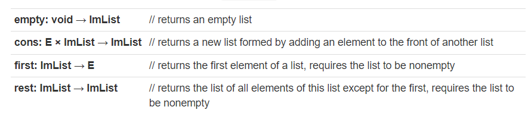
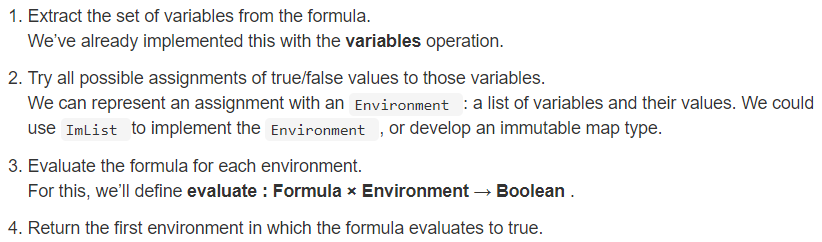

# Recursive functions

Just as a recursive function is defined in terms of itself, a recursive datatype is defined in terms of itself. We’ll see the same need for base and recursive cases, which will now appear as different variants of the abstract type.

# Immutable lists

We’ll start with a classic recursive datatype, the immutable list .

Immutability is powerful not just because of its safety, but also because of the potential for sharing. Sharing produces performance benefits: less memory consumed, less time spent copying.

Let’s define a data type for an immutable list, ImList&lt;E&gt; . The data type has four fundamental operations:



These four operations have a long and distinguished pedigree. They are fundamental to the list-processing languages Lisp and Scheme (known as nil, cons, car, cdr).

The fundamental relationship between first , rest , and cons is:

```
first(cons(elt, lst) ) = elt
rest(cons(elt, lst) ) = lst
```

What cons puts together, first and rest peel back apart.

## Immutable lists in Java

To implement this datatype in Java, we’ll use an interface:

```
public interface ImList<E> {
    // TODO: ImList<E> empty()
    public ImList<E> cons(E e);
    public E first();
    public ImList<E> rest();
}
```

And we’ll write two classes that implement this interface:

- Empty represents the result of the empty operation (an empty list)
- Cons represents the result of a cons operation (an element glued together with another list)

```
public class Empty<E> implements ImList<E> {
    public Empty() {
    }
    public ImList<E> cons(E e) {
        return new Cons<>(e, this);
    }
    public E first() {
        throw new UnsupportedOperationException();
    }
    public ImList<E> rest() {
        throw new UnsupportedOperationException();
    }
}
```

```
public class Cons<E> implements ImList<E> {
    private final E e;
    private final ImList<E> rest;

    public Cons(E e, ImList<E> rest) {
        this.e = e;
        this.rest = rest;
    }
    public ImList<E> cons(E e) {
        return new Cons<>(e, this);
    }
    public E first() {
        return e;
    }
    public ImList<E> rest() {
        return rest;
    }
}
```

One way to implement empty is to have clients call the Empty class constructor to obtain empty lists. This sacrifices representation independence — clients have to know about the Empty class!

As we saw in Interfaces , a better way to do it is as a static factory method that takes no arguments and produces an instance of Empty . We can put this static method in the ImList interface along with the other operations. We update our ImList interface with the static empty method as:

```
public interface ImList<E> {
    public static <E> ImList<E> empty() {
        return new Empty<>();
    }
    public ImList<E> cons(E e);
    public E first();
    public ImList<E> rest();
}
```

## Two classes implementing one interface

Note that this design is different from what we have seen with List , ArrayList , and LinkedList . List is an abstract data type and ArrayList and LinkedList are two alternative concrete representations for that datatype.

For ImList , the two implementations Empty and Cons cooperate in order to implement the datatype — you need them both.

# Recursive datatype definitions

The abstract data type ImList , and its two concrete classes Empty and Cons , form a recursive data type. Cons is an implementation of ImList , but it also uses ImList inside its own rep (for the rest field), so it recursively requires an implementation of ImList in order to successfully implement its contract.

To make this fact clearly visible, we’ll write a **datatype definition**:

```
ImList<E> = Empty + Cons(first:E, rest:ImList)
```

This is a recursive definition of ImList as a set of values. Read it like this: the set ImList consists of values formed in two ways: either by the Empty constructor, or by applying the Cons constructor to an element and an ImList .

Formally, a **datatype definition** has:

- an **abstract datatype** on the left, defined by its **representation** (or **concrete datatype**) on the right
- the representation consists of **variants** of the datatype separated by +
- each variant is a constructor with zero or more named (and typed) arguments

Another example is a binary tree:

```
Tree<E> = Empty + Node(e:E, left:Tree<E>, right:Tree<E>)
```

# Functions over recursive datatypes

This way of thinking about datatypes is appealing not only because it can handle recursive and unbounded structures like lists and trees, but also because it provides a way to describe operations over the datatype, as functions with one case per variant.

For example, consider the size of the list, which is certainly an operation we’ll want in ImList . We can define it like this:

**size : ImList → int** // returns the size of the list

and then fully specify its meaning by defining size for each variant of ImList :

```
size(Empty) = 0
size(Cons(first: E, rest: ImList)) = 1 + size(rest)
```

This function is recursive. We can think about the execution of size on a particular list as a series of reduction steps:

```
size(Cons (0, Cons (1, Empty)))
= 1 + size(Cons (1, Empty))
= 1 + (1 + size(Empty))
= 1 + (1 + 0)
= 1 + 1
= 2
```

And the cases from the definition can be translated directly into Java as methods in ImList , Empty , and Cons :

```
public interface ImList<E> {
    // ...
    public int size();
}

public class Empty<E> implements ImList<E> {
    // ...
    public int size() { return 0; }
}

public class Cons<E> implements ImList<E> {
    // ...
    public int size() { return 1 + rest.size(); }
}
```

This pattern of implementing an operation over a recursive datatype by

- **declaring** the operation in the abstract datatype interface
- **implementing** the operation (recursively) in each concrete variant

Let’s try a few more examples:

```
isEmpty(Empty) = true
isEmpty(Cons(first: E, rest: ImList)) = false
```

**contains : ImList × E → boolean**

```
contains(Empty, e: E) = false
contains(Cons(first: E, rest: ImList), e: E) = (first = e) ∨ contains(rest, e)
```

**append: ImList × ImList → ImList**

```
append(Empty, list2: ImList) = list2
append(Cons(first: E, rest: ImList), list2: ImList) = cons(first, append(rest, list2))
```

# Tuning the rep

As of right now our limplementation of size() is linear time, or O(n). We can improve this by caching the size of the ImList the first time it is computed. This will improve it to constant time or O(1).

```
public class Cons<E> implements ImList<E> {
    private final E e;
    private final ImList<E> rest;
    private int size = 0;
    // rep invariant:
    //   e != null, rest != null, size >= 0
    //   size > 0 implies size == 1+rest.size()

    // ...
    public int size() { 
        if (size == 0) size = 1 + rest.size();
        return size;
    }
}
```

Note that we’re using the special value 0 (which can never be the size of a Cons ) to indicate that we haven’t computed the size yet.

There’s something interesting happening here: this is an immutable datatype, and yet it has a mutable rep. It’s modifying its own size field. This is an example of a **beneficent mutation**, a state change that doesn’t change the abstract value represented by the object, so the type is still immutable.

## Rep independence and rep exposure revisited

Does our Java implementation of ImList still have rep independence? We’ve concealed the Empty contructor behind the static method ImList.empty() , and clients should never need to use the Empty or Cons constructors directly. We can hide them further by making them package-private (declared with neither the public nor private keyword) so that classes outside of ImList ’s package cannot see or use them.

We have a great deal of freedom to change our implementation — indeed, we just added a size field to the internal rep of Cons . We could even have an extra array in there to make get() run fast! This might get expensive in space, however, but we are free to make those tradeoffs.

# Null vs. empty

It might be tempting to get rid of the Empty class and just use null instead. Resist that temptation.

Using an object, rather than a null reference, to signal the base case or endpoint of a data structure is an example of a design pattern called **sentinel objects**. The enormous advantage that a sentinel object provides is that it acts like an object in the datatype, so you can call methods on it. So we can call the size() method even on an empty list. If empty lists were represented by null , then we wouldn’t be able to do that, and as a consequence our code would be full of tests like:
`if (lst != null) n = lst.size();`

### Keep `null`s out of your data structures, and your life will be happier.

# Declared type vs. actual type

There are two worlds in type checking: compile time before the program runs, and run time when the program is executing.

At **compile time**, every variable has a **declared type**, stated in its declaration. The compiler uses the declared types of variables (and method return values) to deduce declared types for every expression in the program.

At **run time**, every object has an **actual type**, imbued in it by the constructor that created the object. For example, new String() makes an object whose actual type is String. new ImList() is forbidden by Java, because ImList is an interface — it has no object values of its own, and no constructors.

# Another example: Boolean formulas

`(P ∨ Q) ∧ ( ¬ P ∨ R)`

We can give a datatype definition suitable for representing all formulas of propositional logic.

```
Formula = Variable(name:String)
          + Not(formula:Formula)
          + And(left:Formula, right:Formula)
          + Or(left:Formula, right:Formula)
```

```
And( Or(Variable("P"), Variable("Q")),
     Or(Not(Variable("P")), Variable("R")) )
```

A key operation for Boolean formulas is testing whether they are satisfiable , that is, whether some assignment of true/false values to the variables leads the formula to evaluate to true. There is a simple but slow algorithm for checking satisfiability:



## Backtracking search with immutability

We started out with immutable lists, which are a representation that permits a lot of sharing between different list instances. Sharing of a particular kind, though: only the ends of lists can actually be shared. If two lists are identical at the beginning but then diverge from each other, they have to be stored separately.

It turns out that backtracking search is a great application for these lists. A search through a space generally proceeds by making one choice after another, and when a choice leads to a dead end, you backtrack.

Mutable data structures are not a good approach for backtracking. If you use a mutable Map , to keep track of the current variable bindings you’re trying, then you have to undo those bindings every time you backtrack. That’s error-prone and painful compared to what you do with immutable maps — when you backtrack, you just throw the map away!

Immutable data structures with no sharing aren’t a great idea either, because the space you need to keep track of where you are (in the case of the satisfiability problem, the environment) will grow quadratically if you have to make a complete copy every time you take a new step. You need to hold on to all the previous environments on your path, in case you need to back up.

Immutable lists have the nice property that each step taken on the path can share all the information from the previous steps, just by adding to the front of the list. When you have to backtrack, you stop using the current step’s state — but you still have references to the previous step’s state.

# Summary

In addition to the big idea of  **recursive datatypes**, we saw in this reading:

- **datatype definitions**: a powerful way to think about abstract types, particularly recursive ones
- **functions over recursive datatypes**: declared in the specification for the type, and implemented with one case per concrete variant
- immutable lists: a classic, canonical example of an immutable datatype

As always, we ask how these ideas make our code  **safer from bugs** ,  **easier to understand** , and more  **ready for change** . Look again at the  [definition and implementation of  `size()` in  `ImList`](https://ocw.mit.edu/ans7870/6/6.005/s16/classes/16-recursive-data-types/recursive/#functions_over_recursive_datatypes) . The definition is little more than the mathematical definition of size. The code is little more than the definition, with some semicolons to placate the compiler.

If we examine the definitions for further methods —  `isEmpty` ,  `contains` , etc. — in each case we see a safe, easy-to-read implementation waiting to be coded. Since we’ve taken the time to specify these operations, if we avoid rep exposure and maintain rep independence, we know our code is ready for change: different clients will be able to reuse our datatype, and we will be able to update the implementation without breaking them.