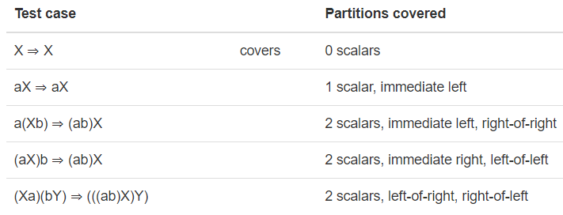

# Recipes for programming

Recall the test-first programming approach for
**Writing a procedure** (a static method):

1.  **Spec.** Write the spec, including the method signature (name, argument types, return types, exceptions), and the precondition and the postcondition as a Javadoc comment.
2.  **Test.** Create systematic test cases and put them in a JUnit class so you can run them automatically.
    1.  You may have to go back and change your spec when you start to write test cases. Just the process of writing test cases puts pressure on your spec, because you’re thinking about how a client would call the method. So steps 1 and 2 iterate until you’ve got a better spec and some good test cases.
    2.  Make sure at least some of your tests are *failing* at first. A test suite that passes all tests even when you haven’t implemented the method is not a good test suite for finding bugs.
3.  **Implement.** Write the body of the method. You’re done when the tests are all green in JUnit.
    1.  Implementing the method puts pressure on both the tests and the specs, and you may find bugs in them that you have to go back and fix. So finishing the job may require changing the implementation, the tests, and the specs, and bouncing back and forth among them.

Let’s broaden this to a recipe for
**Writing an abstract data type** :

1.  **Spec.** Write specs for the operations of the datatype, including method signatures, preconditions, and postconditions.
2.  **Test.** Write test cases for the ADT’s operations.
    1.  Again, this puts pressure on the spec. You may discover that you need operations you hadn’t anticipated, so you’ll have to add them to the spec.
3.  **Implement.** For an ADT, this part expands to:
    1.  **Choose rep.** Write down the private fields of a class, or the variants of a recursive datatype. Write down the rep invariant as a comment.
    2.  **Assert rep invariant.** Implement a `checkRep()` method that enforces the rep invariant. This is critically important if the rep invariant is nontrivial, because it will catch bugs much earlier.
    3.  **Implement operations.** Write the method bodies of the operations, making sure to call `checkRep()` in them. You’re done when the tests are all green in JUnit.

And let’s broaden it further to a recipe for
**Writing a program** (consisting of ADTs and procedures):

1.  **Choose datatypes.** Decide which ones will be mutable and which immutable.
2.  **Choose procedures.** Write your top-level procedure and break it down into smaller steps.
3.  **Spec.** Spec out the ADTs and procedures. Keep the ADT operations simple and few at first. Only add complex operations as you need them.
4.  **Test.** Write test cases for each unit (ADT or procedure).
5.  **Implement simply first.** Choose simple, brute-force representations. The point here is to put pressure on the specs and the tests, and try to pull your whole program together as soon as possible. Make the whole program work correctly first. Skip the advanced features for now. Skip performance optimization. Skip corner cases. Keep a to-do list of what you have to revisit.
6.  **Reimplement and iterate and optimize.** Now that it’s all working, make it work better.

## Problem: matrix multiplication

Suppose we want to compute matrix multiplications and we want to do them faster.

For example, if *a* , *b* are scalar constants, and *X* is a big matrix, then\

`*(aX)b*`

is slow to compute because it loops over the matrix *X* twice: once to multiply it by *a* , and then again to multiply it by *b* . It’d be equivalent and cheaper to do:

`*(ab)X*`

That’s just one example of an optimization we could make by rearranging the products in a matrix multiplication.

### Choose datatypes

Let’s call this a `MatrixExpression` . To make the definitions easier to read, we’ll abbreviate that to `MatExpr` .

Let’s define some operations:

**make** : double → MatExpr
// effects: returns an expression consisting of just the given scalar

**make** : double\[\]\[\] → MatExpr
// requires: array.length > 0, and array\[i\].lengths are equal and > 0, for all i
// effects: returns an expression consisting of just the given matrix

**times** : MatExpr × MatExpr → MatExpr
// requires: m1 and m2 are compatible for multiplication
// effects: returns m1×m2

**isIdentity** : MatExpr → boolean
// effects: returns true if the expression is the multiplicative identity

And the one we really want:

**optimize** : MatExpr → MatExpr
// effects: returns an expression with the same value, but which may be faster to compute

### Test

Let’s test `optimize()` . Partitions:

- Number of scalars in expression: 0, 1, 2, >2
- Position of scalar in expression tree: immediate left, immediate right, left-of-left, left-of-right, right-of-left, right-of-right



### Choose a rep

This problem is a natural one for a recursive datatype.

MatExpr = Identity + Scalar(double) + Matrix(double\[\]\[\]) + Product(MatExpr, MatExpr)

```
/** Represents an immutable expression of matrix and scalar products. */
public interface MatrixExpression {
   // ...
}

class Identity implements MatrixExpression {
   public Identity() {
   }
}

class Scalar implements MatrixExpression {
   private final double value;
   public Scalar(double value) {
       this.value = value;
   }
}

class Matrix implements MatrixExpression {
   private final double[][] array;
   // RI: array.length > 0, and all array[i] are equal nonzero length
   public Matrix(double[][] array) {
       this.array = array; // note: danger!
   }
}

class Product implements MatrixExpression {
   private final MatrixExpression m1;
   private final MatrixExpression m2;
   // RI: m1's column count == m2's row count, or m1 or m2 is scalar
   public Product(MatrixExpression m1, MatrixExpression m2) {
       this.m1 = m1;
       this.m2 = m2;
   }
}
```

# Choose an identity

It’s always good to have a value in the datatype that represents nothing, so that we can avoid using `null` . For a matrix product, the natural choice is the identity matrix — an empty product expression is just the identity anyway. So let’s define that:

```
/** Identity for all matrix computations. */
public static final MatrixExpression I = new Identity();
```

Unfortunately, we’ll see that this is not a perfect situation: other MatExprs might *also* be the identity.

### Implementing `make` : use factory methods

First, the `make()` creators.

We don’t want to expose our concrete rep classes `Scalar` , `Matrix` , and `Product` , so that clients won’t depend on them and we’ll be able to change them later (being *ready for change* ).

So we’ll create static methods in `MatrixExpression` to implement `make()` :

```
/** @return a matrix expression consisting of just the scalar value */
public static MatrixExpression make(double value) {
    return new Scalar(value);
}

/** @return a matrix expression consisting of just the matrix given */
public static MatrixExpression make(double[][] array) {
    return new Matrix(array);
}
```

These are called **factory methods** — static methods that play the role of constructors. The factory-method pattern is a common design pattern in object-oriented programming.

### Implementing `isIdentity` : don’t use `instanceof`

Now let’s implement the `isIdentity` observer. Here’s a **bad** way to do it:

```
// don't do this
public static boolean isIdentity(MatrixExpression m) {
    if (m instanceof Scalar) {
        return ((Scalar)m).value == 1;
    } else if (m instanceof Matrix) {
        // ... check for 1s on the diagonal and 0s everywhere else
    } else ... // do the right thing for other variant classes
}
```

In general, using `instanceof` in object-oriented programming is a bad smell. Break the operation down into pieces that are appropriate for each class, and write instance methods instead:

```
class Identity implements MatrixExpression {
    public boolean isIdentity() { return true; }
}

class Scalar implements MatrixExpression {
    public boolean isIdentity() { return value == 1; }
}

class Matrix implements MatrixExpression {
    public boolean isIdentity() { 
        for (int row = 0; row < array.length; row++) {
            for (int col = 0; col < array[row].length; col++) {
                double expected = (row == col) ? 1 : 0;
                if (array[row][col] != expected) return false;
            }
        }
        return true;
    }
}

class Product implements MatrixExpression {
    public boolean isIdentity() { 
        return m1.isIdentity() && m2.isIdentity();
    }
}
```

Implementing `isIdentity` exposes an issue that we *should* have first discovered by writing test cases: we will not always return `true` for a `Product` whose value is the identity matrix (e.g. A × A <sup>-1</sup> ). We probably want to resolve this by *weakening* the spec of `isIdentity` .

### Implementing `optimize` without `instanceof`

Let’s implement `optimize()` . Again, here’s a **bad** way to do it:

```
// don't do this
class Product implements MatrixExpression {
    public MatrixExpression optimize() {
        if (m1 instanceof Scalar) {
            ...
        } else if (m2 instanceof Scalar) {
            ...
        }
        ...
}
```

If you find yourself writing code with  `instanceof` checks all over the place, you need to take a step back and rethink the problem.

In particular, to optimize the scalars, we’re going to need two recursive helper operations, so we’ll add them to our abstract datatype:

**scalars** : MatExpr → MatExpr
// effects: returns a MatExpr with no matrices in it, only the scalars

**matrices** : MatExpr → MatExpr
// effects: returns a MatExpr with no scalars in it, only matrices in the same order they appear in the input expression

These expressions will allow us to pull the scalars out of an expression and move them together in a single multiplication expression.

```
/** Represents an immutable expression of matrix and scalar products. */
public interface MatrixExpression {

    // ...

    /** @return the product of all the scalars in this expression */
    public MatrixExpression scalars();

    /** @return the product of all the matrices in this expression.
     * times(scalars(), matrices()) is equivalent to this expression. */
    public MatrixExpression matrices();
}
```

Now we’ll implement them as expected:

```
class Identity implements MatrixExpression {
    public MatrixExpression scalars() { return this; }
    public MatrixExpression matrices() { return this; }
}

class Scalar implements MatrixExpression {
    public MatrixExpression scalars() { return this; }
    public MatrixExpression matrices() { return I; }
}

class Matrix implements MatrixExpression {
    public MatrixExpression scalars() { return I; }
    public MatrixExpression matrices() { return this; }
}

class Product implements MatrixExpression {
    public MatrixExpression scalars() {
        return times(m1.scalars(), m2.scalars());
    }
    public MatrixExpression matrices() {
        return times(m1.matrices(), m2.matrices());
    }
}
```

With these helper functions,  `optimize()` can just separate the scalars and the matrices:

```
class Identity implements MatrixExpression {
    public MatrixExpression optimize() { return this; }
}

class Scalar implements MatrixExpression {
    public MatrixExpression optimize() { return this; }
}

class Matrix implements MatrixExpression {
    public MatrixExpression optimize() { return this; }
}

class Product implements MatrixExpression {
    public MatrixExpression optimize() {
        return times(scalars(), matrices());
    }
}
```

## Summary

Let’s review how recursive datatypes fit in with the main goals of this course:

- **Safe from bugs**. Recursive datatypes allow us to tackle problems with a recursive or unbounded structure. Implementing appropriate data structures that encapsulate important operations and maintain their own invariants is crucial for correctness.
    
- **Easy to understand**. Functions over recursive datatypes, specified in the abstract type and implemented in each concrete variant, organize the different behavior of the type.
    
- **Ready for change**. A recursive ADT, like any ADT, separates abstract values from concrete representations, making it possible to change low-level code and high-level structure of the implementation without changing clients.