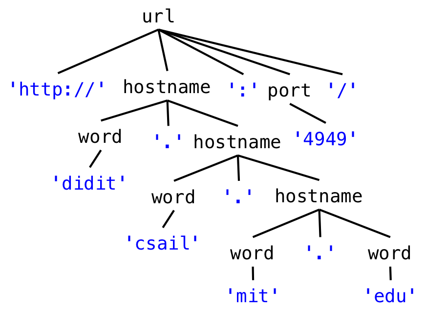

## Introduction

Today’s reading introduces several ideas:

- grammars, with productions, nonterminals, terminals, and operators
- regular expressions
- parser generators

Some program modules take input or produce output in the form of a sequence of bytes or a sequence of characters, which is called a *string* when it’s simply stored in memory, or a *stream* when it flows into or out of a module. In today’s reading, we talk about how to write a specification for such a sequence. Concretely, a sequence of bytes or characters might be:

- A file on disk, in which case the specification is called the *file format*
- Messages sent over a network, in which case the specification is a *wire protocol*
- A command typed by the user on the console, in which case the specification is a *command line interface*
- A string stored in memory

For these kinds of sequences, we introduce the notion of a *grammar* , which allows us not only to distinguish between legal and illegal sequences, but also to parse a sequence into a data structure that a program can work with.

We also talk about a specialized form of a grammar called a *regular expression* . In addition to being used for specification and parsing, regular expressions are a widely-used tool for many string-processing tasks that need to disassemble a string, extract information from it, or transform it.

The next reading will talk about parser generators, a kind of tool that translate a grammar automatically into a parser for that grammar.

## Grammars

To describe a sequence of symbols, whether they are bytes, characters, or some other kind of symbol drawn from a fixed set, we use a compact representation called a *grammar* .

A *grammar* defines a set of sentences, where each *sentence* is a sequence of symbols. For example, our grammar for URLs will specify the set of sentences that are legal URLs in the HTTP protocol.

The symbols in a sentence are called *terminals*.
They’re called terminals because they are the leaves of a tree that represents the structure of the sentence. They don’t have any children, and can’t be expanded any further. We generally write terminals in quotes, like `'http'` or `':'` .

A grammar is described by a set of *productions* , where each production defines a *nonterminal* . You can think of a nonterminal like a variable that stands for a set of sentences, and the production as the definition of that variable in terms of other variables (nonterminals), operators, and constants (terminals). Nonterminals are internal nodes of the tree representing a sentence.

A production in a grammar has the form

> nonterminal ::= expression of terminals, nonterminals, and operators

One of the nonterminals of the grammar is designated as the *root* . The set of sentences that the grammar recognizes are the ones that match the root nonterminal. This nonterminal is often called `root` or `start` , but in the grammars below we will typically choose more memorable names like `url` , `html` , and `markdown` .

### Grammar Operators

The three most important operators in a production expression are:

- concatenation

```
x ::= y z     an x is a y followed by a z 
```

- repetition

```
x ::= y*      an x is zero or more y 
```

- union (also called alternation)

```
x ::= y | z     an x is a y or a z 
```

You can also use additional operators which are just syntactic sugar (i.e., they’re equivalent to combinations of the big three operators):

- option (0 or 1 occurrence)

```
x ::=  y?      an x is a y or is the empty sentence
```

- 1+ repetition (1 or more occurrences)

```
x ::= y+       an x is one or more y
               (equivalent to  x ::= y y* )
```

- character classes

```
x ::= [abc]  is equivalent to  x ::= 'a' | 'b' | 'c' 

x ::= [^b]   is equivalent to  x ::= 'a' | 'c' | 'd' | 'e' | 'f' 
                                         | ... (all other characters)
```

By convention, the operators `*` , `?` , and `+` have highest precedence, which means they are applied first. Alternation `|` has lowest precedence, which means it is applied last. Parentheses can be used to override this precedence, so that a sequence or alternation can be repeated:

- grouping using parentheses

```
x ::=  (y z | a b)*   an x is zero or more y-z or a-b pairs
```

### Example: URL

Suppose we want to write a grammar that represents URLs. Let’s build up a grammar gradually by starting with simple examples and extending the grammar as we go.

Here’s a simple URL:

```
http://mit.edu/
```

A grammar that represents the set of sentences containing *only this URL* would look like:

```
url ::= 'http://mit.edu/'
```

But let’s generalize it to capture other domains, as well:

```
http://stanford.edu/, http://google.com/
```

We can write this as one line, like this:

```
url ::= 'http://' [a-z]+ '.' [a-z]+  '/'
```

This grammar represents the set of all URLs that consist of just a two-part hostname, where each part of the hostname consists of 1 or more letters. So `http://mit.edu/` and `http://yahoo.com/` would match, but not `http://ou812.com/`.

In this one-line form, with a single nonterminal whose production uses only operators and terminals, a grammar is called a *regular expression* (more about that later). But it will be easier to understand if we name the parts using new nonterminals:

```
url ::= 'http://' hostname '/'
hostname ::= word '.' word
word ::= [a-z]+
```

How else do we need to generalize? Hostnames can have more than two components, and there can be an optional port number:

```
http://didit.csail.mit.edu:4949/
```

To handle this kind of string, the grammar is now:

```
url ::= 'http://' hostname (':' port)? '/' 
hostname ::= word '.' hostname | word '.' word
port ::= [0-9]+
word ::= [a-z]+
```



*Notice how hostname is now defined recursively in terms of itself.* Which part of the hostname definition is the base case, and which part is the recursive step? What kinds of hostnames are allowed?

Using the repetition operator, we could also write hostname like this:

```
hostname ::= (word '.')+ word
```

## Regular Expressions

A *regular* grammar has a special property: by substituting every nonterminal (except the root one) with its righthand side, you can reduce it down to a single production for the root, with only terminals and operators on the right-hand side.

Our URL grammar was regular. By replacing nonterminals with their productions, it can be reduced to a single expression:

```
url ::= 'http://' ([a-z]+ '.')+ [a-z]+ (':' [0-9]+)? '/' 
```

The reduced expression of terminals and operators can be written in an even more compact form, called a *regular expression* . A regular expression does away with the quotes around the terminals, and the spaces between terminals and operators, so that it consists just of terminal characters, parentheses for grouping, and operator characters. For example, the regular expression for our `markdown` format is just

```
([^_]*|_[^_]*_)*
```

Regular expressions are also called *regexes* for short. A regex is far less readable than the original grammar, because it lacks the nonterminal names that documented the meaning of each subexpression. But a regex is fast to implement, and there are libraries in many programming languages that support regular expressions.

The regex syntax commonly implemented in programming language libraries has a few more special operators, in addition to the ones we used above in grammars. Here’s are some common useful ones:

```
.       any single character

\d      any digit, same as [0-9]
\s      any whitespace character, including space, tab, newline
\w      any word character, including letters and digits

\., \(, \), \*, \+, ...
        escapes an operator or special character so that it matches literally
```

Using backslashes is important whenever there are terminal characters that would be confused with special characters. Because our `url` regular expression has `.` in it as a terminal, we need to use a backslash to escape it:

```
http://([a-z]+\.)+[a-z]+(:[0-9]+)/
```

## Summary

- **Safe from bugs.** Grammars and regular expressions are declarative specifications for strings and streams, which can be used directly by libraries and tools. These specifications are often simpler, more direct, and less likely to be buggy then parsing code written by hand.
    
- **Easy to understand.** A grammar captures the shape of a sequence in a form that is easier to understand than hand-written parsing code. Regular expressions, alas, are often not easy to understand, because they are a one-line reduced form of what might have been a more understandable regular grammar.
    
- **Ready for change.** A grammar can be easily edited, but regular expressions, unfortunately, are much harder to change, because a complex regular expression is cryptic and hard to understand.