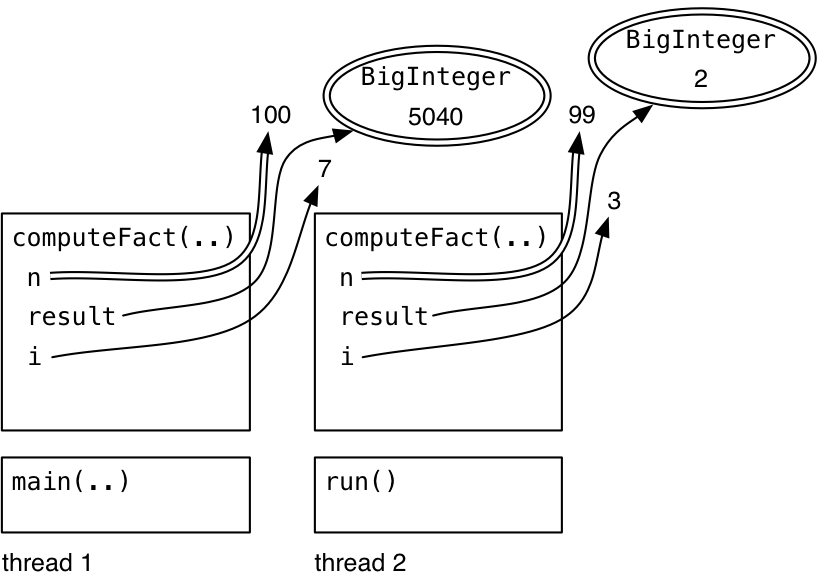

#### Objectives

Recall race conditions: multiple threads sharing the same mutable variable without coordinating what they’re doing. This is unsafe, because the correctness of the program may depend on accidents of timing of their low-level operations.

There are basically four ways to make variable access safe in shared-memory concurrency:

- **Confinement.** Don’t share the variable between threads. This idea is called confinement, and we’ll explore it today.
- **Immutability.** Make the shared data immutable. We’ve talked a lot about immutability already, but there are some additional constraints for concurrent programming that we’ll talk about in this reading.
- **Threadsafe data type.** Encapsulate the shared data in an existing threadsafe data type that does the coordination for you. We’ll talk about that today.
- **Synchronization.** Use synchronization to keep the threads from accessing the variable at the same time. Synchronization is what you need to build your own threadsafe data type.

The material in this reading is inspired by an excellent book: Brian Goetz et al., *[Java Concurrency in Practice](https://jcip.net/)* , Addison-Wesley, 2006.

## What Threadsafe Means

A data type or static method is *threadsafe* if it behaves correctly when used from multiple threads, regardless of how those threads are executed, and without demanding additional coordination from the calling code.

- “behaves correctly” means satisfying its specification and preserving its rep invariant;
- “regardless of how threads are executed” means threads might be on multiple processors or timesliced on the same processor;
- “without additional coordination” means that the data type can’t put preconditions on its caller related to timing, like “you can’t call `get()` while `set()` is in progress.”

Remember [`Iterator`](https://docs.oracle.com/javase/8/docs/api/?java/util/Iterator.html) ? It’s not threadsafe. `Iterator` ’s specification says that you can’t modify a collection at the same time as you’re iterating over it. That’s a timing-related precondition put on the caller, and `Iterator` makes no guarantee to behave correctly if you violate it.

## Strategy 1: Confinement

Our first way of achieving thread safety is *confinement* . Thread confinement is a simple idea: you avoid races on mutable data by keeping that data confined to a single thread. Don’t give any other threads the ability to read or write the data directly.

Since shared mutable data is the root cause of a race condition, confinement solves it by *not sharing* the mutable data.

Local variables are always thread confined. A local variable is stored in the stack, and each thread has its own stack. There may be multiple invocations of a method running at a time (in different threads or even at different levels of a single thread’s stack, if the method is recursive), but each of those invocations has its own private copy of the variable, so the variable itself is confined.

But be careful – the variable is thread confined, but if it’s an object reference, you also need to check the object it points to. If the object is mutable, then we want to check that the object is confined as well – there can’t be references to it that are reachable from any other thread.

Confinement is what makes the accesses to `n` , `i` , and `result` safe in an example code which computes factorial:



### Avoid Global Variables

Unlike local variables, static variables are not automatically thread confined.

If you have static variables in your program, then you have to make an argument that only one thread will ever use them, and you have to document that fact clearly. Better, you should eliminate the static variables entirely.

Here’s an example:

```
// This class has a race condition in it.
public class PinballSimulator {

    private static PinballSimulator simulator = null;
    // invariant: there should never be more than one PinballSimulator
    //            object created

    private PinballSimulator() {
        System.out.println("created a PinballSimulator object");
    }

    // factory method that returns the sole PinballSimulator object,
    // creating it if it doesn't exist
    public static PinballSimulator getInstance() {
        if (simulator == null) {
            simulator = new PinballSimulator();
        }
        return simulator;
    }
}
```

This class has a race in the `getInstance()` method – two threads could call it at the same time and end up creating two copies of the `PinballSimulator` object.

To fix this race using the thread confinement approach, you would specify that only a certain thread is allowed to call `PinballSimulator.getInstance()` . But Java won’t help you guarantee this.

In general, static variables are very risky for concurrency. They might be hiding behind an innocuous function that seems to have no side-effects or mutations. Consider this example:

```
// is this method threadsafe?
/**
 * @param x integer to test for primeness; requires x > 1
 * @return true if x is prime with high probability
 */
public static boolean isPrime(int x) {
    if (cache.containsKey(x)) return cache.get(x);
    boolean answer = BigInteger.valueOf(x).isProbablePrime(100);
    cache.put(x, answer);
    return answer;
}

private static Map<Integer,Boolean> cache = new HashMap<>();
```

[Memoization i](https://en.wikipedia.org/wiki/Memoization)s a sensible optimization for slow functions like exact primality testing. But now the `isPrime` method is not safe to call from multiple threads, and its clients may not even realize it. The reason is that the `HashMap` referenced by the static variable `cache` is shared by all calls to `isPrime()` , and `HashMap` is not threadsafe. If multiple threads mutate the map at the same time, by calling `cache.put()` , then the map can become corrupted.

## Strategy 2: Immutability

Our second way of achieving thread safety is by using immutable references and data types. Immutability tackles the shared-mutable-data cause of a race condition and solves it simply by making the shared data *not mutable* .

Final variables are immutable references, so a variable declared final is safe to access from multiple threads. You can only read the variable, not write it. Be careful, because this safety applies only to the variable itself, and **we still have to argue that the object the variable points to is immutable.**

Immutable objects are usually also threadsafe. We say “usually” here because our current definition of immutability is too loose for concurrent programming. We’ve said that a type is immutable if an object of the type always represents the same abstract value for its entire lifetime. But that actually allows the type the freedom to mutate its rep, as long as those mutations are invisible to clients. We saw an example of this notion, called benevolent or beneficent mutation, when we looked at [an immutable list that cached its length in a mutable field](https://ocw.mit.edu/ans7870/6/6.005/s16/classes/16-recursive-data-types/recursive/#tuning_the_rep) the first time the length was requested by a client. Caching is a typical kind of beneficent mutation.

For concurrency, though, this kind of hidden mutation is not safe. An immutable data type that uses beneficent mutation will have to make itself threadsafe using locks (the same technique required of mutable data types).

### Stronger definition of immutability

So in order to be confident that an immutable data type is threadsafe without locks, we need a stronger definition of immutability:

- no mutator methods (i.e. setters).
    
- all fields are private and final.
    
- Don't allow subclasses to override methods. No [representation exposure.](https://ocw.mit.edu/ans7870/6/6.005/s16/classes/13-abstraction-functions-rep-invariants/#invariants)
    
- no mutation whatsoever of mutable objects in the rep – not even [beneficent mutation.](https://ocw.mit.edu/ans7870/6/6.005/s16/classes/16-recursive-data-types/recursive/#tuning_the_rep)
    
    - Don't provide methods that modify the mutable objects.
        
    - Don't share references to the mutable objects. Never store references to external, mutable objects passed to the constructor; if necessary, create copies. Also. only return deep copies of your fields.
        

If you follow these rules, then you can be confident that your immutable type will also be threadsafe.

## Strategy 3: Using Threadsafe Data Types

Our third major strategy for achieving thread safety is to store shared mutable data in existing threadsafe data types.

When a data type in the Java library is threadsafe, its documentation will explicitly state that fact.

### Threadsafe Collections

The collection interfaces in Java – `List` , `Set` , `Map` – have basic implementations that are not threadsafe. The implementations of these that you’ve been used to using, namely `ArrayList` , `HashMap` , and `HashSet` , cannot be used safely from more than one thread.

These wrappers effectively make each method of the collection atomic with respect to the other methods. An **atomic action** effectively happens all at once – it doesn’t interleave its internal operations with those of other actions, and none of the effects of the action are visible to other threads until the entire action is complete, so it never looks partially done.

**Don’t circumvent the wrapper.** Make sure to throw away references to the underlying non-threadsafe collection, and access it only through the synchronized wrapper. That happens automatically in the line of code above, since the new `HashMap` is passed only to `synchronizedMap()` and never stored anywhere else. (We saw this same warning with the unmodifiable wrappers: the underlying collection is still mutable, and code with a reference to it can circumvent immutability.)

**Iterators are still not threadsafe.** Even though method calls on the collection itself ( `get()` , `put()` , `add()` , etc.) are now threadsafe, iterators created from the collection are still not threadsafe. So you can’t use `iterator()` , or the for loop syntax:

```
for (String s: lst) { ... } // not threadsafe, even if lst is a synchronized list wrapper
```

The solution to this iteration problem will be to acquire the collection’s lock when you need to iterate over it.

Finally, **atomic operations aren’t enough to prevent races:** the way that you use the synchronized collection can still have a race condition. Consider this code, which checks whether a list has at least one element and then gets that element:

```
if ( ! lst.isEmpty()) { String s = lst.get(0); ... }
```

Even if you make `lst` into a synchronized list, this code still may have a race condition, because another thread may remove the element between the `isEmpty()` call and the `get()` call.

Even the `isPrime()` method still has potential races:

```
if (cache.containsKey(x)) return cache.get(x);
boolean answer = BigInteger.valueOf(x).isProbablePrime(100);
cache.put(x, answer);
```

The synchronized map ensures that `containsKey()` , `get()` , and `put()` are now atomic, so using them from multiple threads won’t damage the rep invariant of the map. But those three operations can now interleave in arbitrary ways with each other, which might break the invariant that `isPrime` needs from the cache: if the cache maps an integer *x* to a value *f* , then *x* is prime if and only if *f* is true. If the cache ever fails this invariant, then we might return the wrong result.

So we have to argue that the races between `containsKey()` , `get()` , and `put()` don’t threaten this invariant.

1.  The race between `containsKey()` and `get()` is not harmful because we never remove items from the cache – once it contains a result for x, it will continue to do so.
2.  There’s a race between `containsKey()` and `put()` . As a result, it may end up that two threads will both test the primeness of the same x at the same time, and both will race to call `put()` with the answer. But both of them should call `put()` with the same answer, so it doesn’t matter which one wins the race – the result will be the same.

## How to Make a Safety Argument

We’ve seen that concurrency is hard to test and debug. So to convince yourself and others that your concurrent program is correct, the best approach is to make an explicit argument that it’s free from races, and write it down.

A safety argument needs to catalog all the threads that exist in your module or program, and the data that that they use, and argue which of the four techniques you are using to protect against races for each data object or variable: confinement, immutability, threadsafe data types, or synchronization. When you use the last two, you also need to argue that all accesses to the data are appropriately atomic – that is, that the invariants you depend on are not threatened by interleaving. We gave one of those arguments for `isPrime` above.

### Thread Safety Arguments for Data Types

Remember our four approaches to thread safety: confinement, immutability, threadsafe data types, and synchronization. Synchronization is explain in the future.

Confinement is not usually an option when we’re making an argument just about a data type, because you have to know what threads exist in the system and what objects they’ve been given access to. If the data type creates its own set of threads, then you can talk about confinement with respect to those threads. Otherwise, the threads are coming in from the outside, carrying client calls, and the data type may have no guarantees about which threads have references to what. So confinement isn’t a useful argument in that case. Usually we use confinement at a higher level, talking about the system as a whole and arguing why we don’t need thread safety for some of our modules or data types, because they won’t be shared across threads by design.

Immutability is often a useful argument:

```
public class MyString {
    private final char[] a;
    // Thread safety argument:
    //    This class is threadsafe because it's immutable:
    //    - a is final
    //    - a points to a mutable char array, but that array is encapsulated
    //      in this object, not shared with any other object or exposed to a
    //      client
```

Here’s another rep for MyString that requires a little more care in the argument:

```
/** MyString is an immutable data type representing a string of characters. */
public class MyString {
    private final char[] a;
    private final int start;
    private final int len;
    // Rep invariant:
    //    0 <= start <= a.length
    //    0 <= len <= a.length-start
    // Abstraction function:
    //    represents the string of characters a[start],...,a[start+length-1]
    // Thread safety argument:
    //    This class is threadsafe because it's immutable:
    //    - a, start, and len are final
    //    - a points to a mutable char array, which may be shared with other
    //      MyString objects, but they never mutate it
    //    - the array is never exposed to a client
```

Note that since this `MyString` rep was designed for sharing the array between multiple `MyString` objects, we have to ensure that the sharing doesn’t threaten its thread safety. As long as it doesn’t threaten the `MyString` ’s immutability, however, we can be confident that it won’t threaten the thread safety.

We also have to avoid rep exposure. Rep exposure is bad for any data type, since it threatens the data type’s rep invariant. It’s also fatal to thread safety.

### Bad Safety Arguments

Here are some *incorrect* arguments for thread safety:

```
/** MyStringBuffer is a threadsafe mutable string of characters. */
public class MyStringBuffer {
    private String text;
    // Rep invariant:
    //   none
    // Abstraction function:
    //   represents the sequence text[0],...,text[text.length()-1]
    // Thread safety argument:
    //   text is an immutable (and hence threadsafe) String,
    //   so this object is also threadsafe
```

Why doesn’t this argument work? String is indeed immutable and threadsafe; but the rep pointing to that string, specifically the `text` variable, is not immutable. `text` is not a final variable, and in fact it *can’t* be final in this data type, because we need the data type to support insertion and deletion operations. So reads and writes of the `text` variable itself are not threadsafe. This argument is false.

Here’s another broken argument:

```
public class Graph {
    private final Set<Node> nodes =
                   Collections.synchronizedSet(new HashSet<>());
    private final Map<Node,Set<Node>> edges =
                   Collections.synchronizedMap(new HashMap<>());
    // Rep invariant:
    //    for all x, y such that y is a member of edges.get(x),
    //        x, y are both members of nodes
    // Abstraction function:
    //    represents a directed graph whose nodes are the set of nodes
    //        and whose edges are the set (x,y) such that
    //                         y is a member of edges.get(x)
    // Thread safety argument:
    //    - nodes and edges are final, so those variables are immutable
    //      and threadsafe
    //    - nodes and edges point to threadsafe set and map data types
```

This is a graph data type, which stores its nodes in a set and its edges in a map. Graph relies on other threadsafe data types to help it implement its rep – specifically the [threadsafe `Set` and `Map` wrappers](https://ocw.mit.edu/ans7870/6/6.005/s16/classes/20-thread-safety/#threadsafe_collections) that we talked about above. That prevents some race conditions, but not all, because the graph’s rep invariant includes a relationship ***between*** the node set and the edge map. All nodes that appear in the edge map also have to appear in the node set. So there may be code like this:

```
public void addEdge(Node from, Node to) {
    if ( ! edges.containsKey(from)) {
        edges.put(from, Collections.synchronizedSet(new HashSet<>()));
    }
    edges.get(from).add(to);
    nodes.add(from);
    nodes.add(to);
}
```

This code has a race condition in it. There is a crucial moment when the rep invariant is violated, right after the `edges` map is mutated, but just before the `nodes` set is mutated. Another operation on the graph might interleave at that moment, discover the rep invariant broken, and return wrong results. Even though the threadsafe set and map data types guarantee that their own `add()` and `put()` methods are atomic and noninterfering, they can’t extend that guarantee to *interactions* between the two data structures. So the rep invariant of `Graph` is not safe from race conditions. Just using immutable and threadsafe-mutable data types is not sufficient when the rep invariant depends on relationships *between* objects in the rep.

We’ll have to fix this with synchronization in the future.

### Serializability

Look again at the code for the exercise above. We might also be concerned that `clear` and `insert` could interleave such that a client sees `clear` violate its postcondition.

| A   | B   |
| --- | --- |
| call `sb.clear()` |     |
|     | call `sb.insert(0, "a")` |
| — in `clear` : `text = ""` |     |
|     | — in `insert` : `text = "" + "a" + "z"` |
| — `clear` returns |     |
|     | — `insert` returns |
| `assert sb.toString()`<br>`.equals("")` |     |

Suppose two threads are sharing `MyStringBuffer sb` representing `"z"` . They run `clear` and `insert` concurrently as shown on the right.

Thread A’s assertion will fail, but not because `clear` violated its postcondition. Indeed, when all the code in `clear` has finished running, the postcondition is satisfied.

The real problem is that thread A has not anticipated possible interleaving between `clear()` and the `assert` . With any threadsafe mutable type where atomic mutators are called concurrently, *some* mutation has to “win” by being the last one applied. The result that thread A observed is identical to the execution below, where the mutators don’t interleave at all:

| A   | B   |
| --- | --- |
| call `sb.clear()` |     |
| — in `clear` : `text = ""` |     |
| — `clear` returns |     |
|     | call `sb.insert(0, "a")` |
|     | — in `insert` : `text = "" + "a" + "z"` |
|     | — `insert` returns |
| `assert sb.toString()`<br>`.equals("")` |     |

What we demand from a threadsafe data type is that when clients call its atomic operations concurrently, the results are consistent with *some* sequential ordering of the calls. In this case, clearing and inserting, that means either `clear` -followed-by- `insert` , or `insert` -followed-by- `clear` . This property is called [**serializability**](https://en.wikipedia.org/wiki/Serializability) : for any set of operations executed concurrently, the result (the values and state observable by clients) must be a result given by *some* sequential ordering of those operations.

## Summary

This reading talked about three major ways to achieve safety from race conditions on shared mutable data:

- Confinement: not sharing the data.
- Immutability: sharing, but keeping the data immutable.
- Threadsafe data types: storing the shared mutable data in a single threadsafe datatype.

These ideas connect to our three key properties of good software as follows:

- **Safe from bugs.** We’re trying to eliminate a major class of concurrency bugs, race conditions, and eliminate them by design, not just by accident of timing.
    
- **Easy to understand.** Applying these general, simple design patterns is far more understandable than a complex argument about which thread interleavings are possible and which are not.
    
- **Ready for change.** We’re writing down these justifications explicitly in a thread safety argument, so that maintenance programmers know what the code depends on for its thread safety.